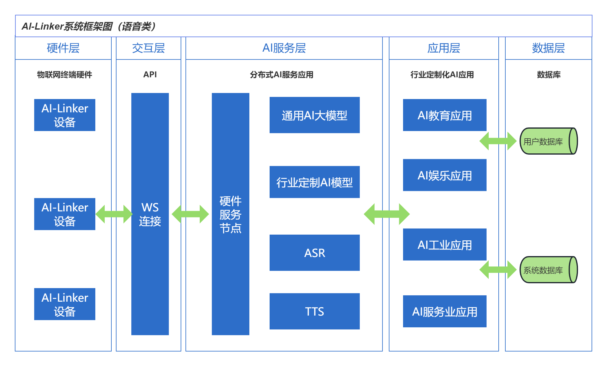

# AiLinker

## 一、项目背景

&emsp; 随着近年来计算机硬件水平的不断发展， 相应的AI算法也发挥了前所未有的威力，尤其是chatGPT大模型的推出，引发了新一轮的AI技术革命；AI文本、AI语音、AI视觉等各种AI技将更广泛的应用于我们的生产生活中，万物AI正以一个新的概念，逐步进入我们的视野。AiLinker的目标是让边缘硬件设备更高效更稳定的连接云端AI技术, 实现本地算法和云端算法的融合，从而实现功能更强大更智能更人性化的AI产品。我们希望能提供一个平台方便大家交流学习AI应用技术，开发AI产品。**这也是本项目的两个初衷，第一，给想学习硬件、学习编程、学习AI应用技术的小伙伴搭建一个简单易用的学习平台，并提供相应的学习硬件软件和教程，帮助他们更好的学习相关技术; 第二，给有想法、有创意的朋友提供相应的硬件和平台支持，减少重复性劳动，帮助他们快速验证和开发更具创意和价值的AI产品。**

## 2.1 系统框架

### 2.2 功能介绍

​	**项目首期我们会先开发一款AI语音助手，初步功能规划如下:**

- **语音对话**：支持接入主流AI大模型、支持连续语音对话、支持自定义对话场景
- **音乐播放**：支持云端音乐点播、支持蓝牙播放本地音乐
- **智能家居**：支持语音识别以及相应指令输出，对接智能家居场景
- **生活辅助**：时间查询、日期查询、闹钟设置等功能。
- **开放对接**：提供相应的接口，可结合其它设备实现功能更强大的AI产品

### 2.3面向的对象:

* 对AI技术感兴趣，但硬件或软件基础较薄弱的开发者，可借助该项目快速打造专属的AI机器人。
* 技术极客，开发能力较强，但不想花费太多时间开发底层硬件，可借助AI模组快速验证实现自己的AI应用。
* 学生或技术爱好者，正在学习硬件及编程技术，可借助该项目快速学习编程技术和AI技术。
* 传统电子产品的厂商及技术人员，借助AI模组可以对既有产品进行快速智能化升级改造。

## 三、项目实施

### 3.1规划和进展

| 名称             | 功能描述              | 是否开源                                                     | 进展                  |
| ---------------- | --------------------- | ------------------------------------------------------------ | --------------------- |
| AI-Linker-Server | AI-Linker后台服务系统 | 是                                                           | 预计6月中旬开源       |
| AI-Linker-Dev    | AI-Linker硬件模组     | 硬件以及通信协议开源、当前固件暂不开源、 后续会出一个开源版的固件(基于arduino开发) | 预计6月中旬可提供套件 |
|                  |                       |                                                              |                       |

### 3.2演示视频

[GPT-4o语音对话](https://t.bilibili.com/933862328380686374?share_source=pc_native)

## 四、联系我们

email: deakinhwang@163.com 

QQ群: 372629033

AI-Linker 项目旨在促进人工智能以及人机交互技术的发展，我们期待您在此基础之上开发出更多有创意的作品，也期待您的参与和贡献。

## 五、开源许可

Copyright © 2024 [NYCF](https://github.com/NYCF).

This project is [MIT](https://github.com/lobehub/lobe-chat/blob/main/LICENSE) licensed.

## 六、资料分享

大模型使用和python入门学习: https://gitee.com/zq51/startWithAI

