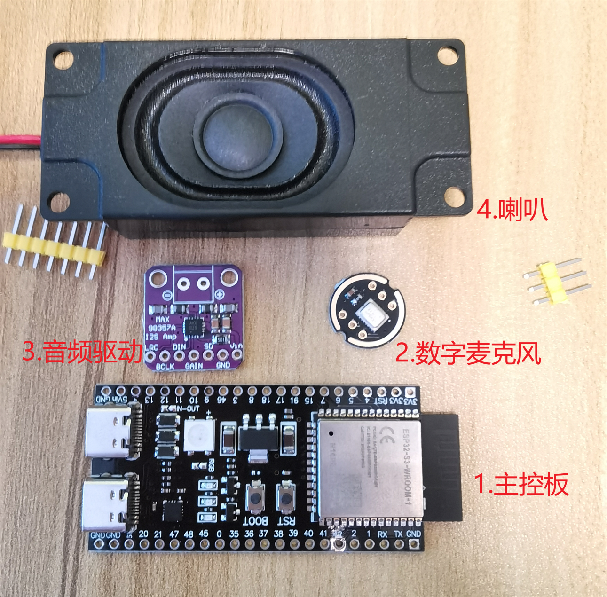

# AI语音聊天助手硬件清单

## 一、硬件选择参考

### 硬件列表

| 序号 | 名称         | 型号                   | 参考驱动                                                     | 备注                                              |
| ---- | ------------ | ---------------------- | ------------------------------------------------------------ | ------------------------------------------------- |
| 1    | 主控板       | ESP32 S3 N16R8         |                                                              | 语音项目对PSRAM有一定要求，最好选择N8R8以上的型号 |
| 2    | 麦克风       | inmp441 数字麦克风     | [inmp441参考驱动](https://atomic14.com/2020/09/12/esp32-audio-input.html) | 这款数字麦克风参考资料较多，适合初学者            |
| 3    | 音频驱动模块 | Max 98357A数字音频功放 | [max98357参考驱动代码](https://github.com/liux-pro/EPS32-S3-I2S-MAX98357/tree/master) | 这款音频功放模块参考资料较多，适合初学者          |
| 4    | 扬声器       | 8欧 3W 带音腔喇叭      |                                                              | 带音腔的喇叭音质较好                              |

### 参考图片：

###### 

以上设备某宝信泰电子均有销售，价格相对实惠。

## 二、参考硬件接线图

​	可参考上述硬件驱动博客和代码进行连接

